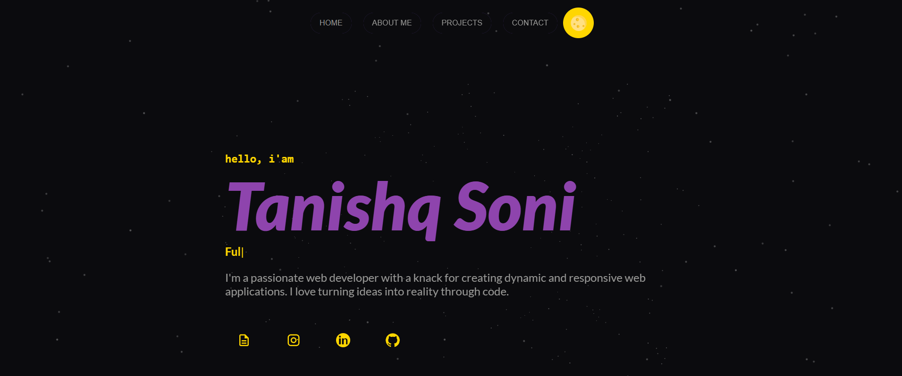

# 🚀 The Creative Corner - Tanishq Soni

**Hey there, Curious Explorer!** 👋  
Welcome to **Tanishq Soni's  Portfolio**—  
A space where **code meets creativity**, and ideas turn into interactive experiences.

---

## 🧑‍💻 Who Am I?

> **"Full Stack Developer by profession, Designer by passion."**

I'm **Tanishq Soni**,  
Currently brushing up on my **backend skills** while exploring new design trends.  
When I'm not coding, you'll find me playing with colors in **graphic designing** or diving into something new just to stay curious.

---

## 🌌 Sneak Peek



*This is just a glimpse of the universe I’m building.* 🚀

---

## 🛠️ Tech Stack I Play With

- ⚛️ **React.js**  
- 🎨 **CSS**  
- 🍃 **MongoDB**  
- 📜 **JavaScript**

---

## 🧰 How to Run This Project Locally

```bash
git clone https://github.com/tanishq2526/Tanishq-portfolio.git
cd Tanishq-portfolio
npm install
npm run dev
```

> **Note:**  
This portfolio is still **under construction**—  
because good things take time. 🚧

## 🔗 Let's Connect

- 📸 **Instagram:** [@oye.tanishq](https://instagram.com/oye.tanishq)  
- 💼 **LinkedIn:** [Tanishq Soni](https://www.linkedin.com/in/Tanishq-Soni2005)

## 🤯 Fun Fact

**"Sometimes I spend more time perfecting the small things no one notices,  
but that’s exactly how you build things people love without knowing why."** 😅


## 💡 Why This Portfolio?

Because I don’t just want to show projects—I want to show **progress**.  
This is my **digital playground** where I grow, learn, and share.

